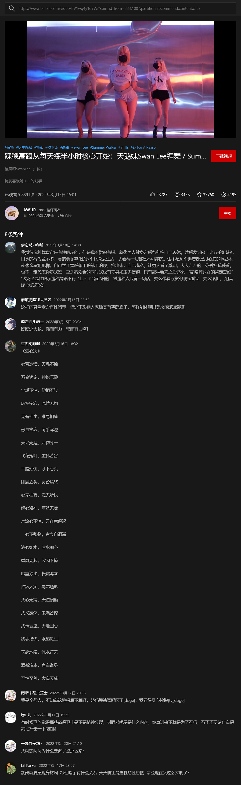
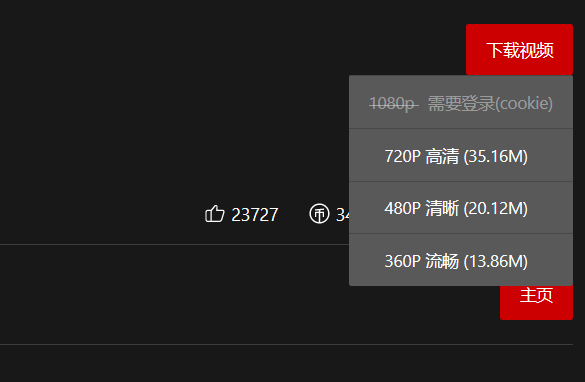

<div align="center">
  <h1>Bilibili Download</h1>
  <blockquote>bilibili视频下载Web平台，免登录，支持下载720p、480p、360p</blockquote>
</div>

## 注意

* 不需要登录，理论上bilibili上不登陆能看的视频都能下载

* 支持个人视频(bv)、番剧(ep)、电视剧(ss)

* 音视频合并，无需合成

* 仅供学习使用

## 安装
```bash
git clone https://gitee.com/imzusheng/bilibili-download.git
cd ./bilibili-download
npm i
node app
```
浏览器中打开`http://localhost:3000`

## 演示






## 功能

* [x] 下载普通视频
* [x] 下载番剧视频
* [x] 下载剧集视频
* [x] 下载切换剧集
* [x] 下载电影(额外付费除外)
* [x] 基本视频信息
* [x] 热门评论
* [ ] 下载封面
* [ ] 下载字幕
* [ ] 下载进度

## 技术细节
[https://blog.zusheng.club](https://blog.zusheng.club)

## 版本

v0.0.1 `2022-03-24`

后续整理用到的API

